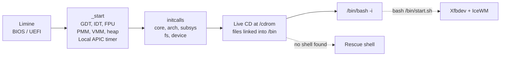

<p align="center">
  <picture>
    <source media="(prefers-color-scheme: dark)" srcset="DOCS/branding/logo-text-white.svg">
    
  </picture>
</p>

<p align="center">
  A hobby x86_64 operating system written from scratch
</p>

<p align="center">
  
  
  
  
  
  
</p>

<p align="center">
  <a href="#screenshots">Screenshots</a> |
  <a href="#features">Features</a> |
  <a href="#architecture">Architecture</a> |
  <a href="#quick-start">Quick start</a> |
  <a href="#using-equantos">Using EquantOS</a> |
  <a href="#roadmap">Roadmap</a> |
  <a href="#known-issues">Known issues</a>
</p>

---

EquantOS is a monolithic x86_64 kernel written in C and NASM. It boots through
[Limine](https://github.com/limine-bootloader/limine) on BIOS and UEFI, sets up its own memory
management, scheduler, VFS, storage, USB and network stacks, then runs static Linux binaries in
Ring 3: GNU Bash, BusyBox, the Xfbdev X server and the IceWM window manager.

QEMU is the main target. EquantOS has also booted on real x86_64 hardware.

```
architecture : x86_64
version      : 0.0.1-alpha
bootloader   : Limine v8 (BIOS + UEFI)
language     : C + x86_64 assembly (NASM)
libc         : musl 1.2.6 (static)
abi          : Linux x86_64 syscalls, about 140 implemented
license      : GPL-2.0
```

> [!WARNING]
> Early alpha. Run it in a VM or on spare hardware and do not keep anything important on disks it
> can write to.

## Screenshots

<table>
  <tr>
    <td width="50%"></td>
    <td width="50%"></td>
  </tr>
  <tr>
    <td align="center">Xfbdev + IceWM + xeyes at 1600x900</td>
    <td align="center">Bash 5.2 + BusyBox on the framebuffer console</td>
  </tr>
</table>

Both screenshots were taken in QEMU from a build of `main`.

## Features

| Area | What is there |
|---|---|
| Boot and CPU | Limine base revision 3, HHDM, framebuffer, GDT, IDT, exception handler with a panic screen, FPU/SSE |
| Interrupts and timer | Local APIC, 250 Hz LAPIC timer calibrated against the PIT, legacy 8259 PIC masked |
| Memory | Buddy physical allocator, 4-level paging, 2 MiB huge pages, PAT (write-combining framebuffer, uncached MMIO), per-process address spaces, copy-on-write, slab heap |
| Processes | ELF64 loader, preemptive scheduler, Ring 3 tasks, `fork`, `vfork`, `clone`, `execve`, `wait4`, `futex`, signals |
| IPC | Pipes, AF_UNIX sockets, SysV shared memory |
| Filesystems | VFS, RAMFS root, devfs, page cache with LRU eviction (8 MiB pool), ext2 read/write, FAT32, ISO9660, GPT, MBR |
| Storage | NVMe with DMA, ATA PIO |
| Input and display | xHCI with USB HID keyboard and mouse, PS/2 keyboard, framebuffer TTY with PSF2 fonts, evdev nodes, `/dev/fb0` with a shadow buffer |
| Network | RTL8139, ARP, IPv4, ICMP, UDP, TCP with retransmission, DHCP, DNS, BSD sockets |
| Userspace | Bash 5.2, BusyBox, Xfbdev, IceWM, TWM, xeyes, `epacmg` package manager over HTTPS (BearSSL), `kdiag`, installer, users with `su`, `passwd` and `useradd` |
| Rescue shell | About 60 kernel commands for disks, memory, PCI, USB and CPU. Starts when no userland shell is found |

## Architecture

```mermaid
flowchart LR
    subgraph USER["Ring 3: userspace (static musl, Linux ABI)"]
        BASH["GNU Bash + BusyBox"]
        X11["Xfbdev + IceWM / TWM"]
        TOOLS["epacmg, kdiag, installer"]
    end

    ABI{{"syscall / int 0x80<br/>Linux x86_64 ABI"}}

    subgraph KERNEL["Ring 0: EquantOS kernel"]
        PROC["Processes<br/>ELF loader, scheduler, signals, futex"]
        MM["Memory<br/>buddy PMM, VMM, COW, slab"]
        FS["VFS<br/>page cache, ext2, FAT32, ISO9660, devfs"]
        NET["Network<br/>TCP/IP, DHCP, DNS, sockets"]
        IPC["IPC<br/>pipes, AF_UNIX, SysV SHM"]
    end

    subgraph DRV["Drivers"]
        D1["NVMe, ATA"]
        D2["xHCI, USB HID, PS/2"]
        D3["Framebuffer, TTY, serial"]
        D4["RTL8139, PCI, LAPIC, RTC"]
    end

    USER --> ABI --> KERNEL --> DRV
```



### Boot sequence



## Quick start

### 1. Install the toolchain

| Tool | Used for |
|---|---|
| `x86_64-elf-gcc`, `x86_64-elf-ld` | Kernel and userspace |
| `nasm` | Assembly sources |
| GNU Make | Build |
| `xorriso` | ISO image |
| Python 3 | Test disk images |
| `qemu-system-x86_64` | Running the system |

The Makefile works from a POSIX shell (Linux, macOS, MSYS2, Git Bash) and from Windows `cmd.exe`.

### 2. Clone

```bash
git clone https://github.com/Equinox-Collective/EquantOS.git
cd EquantOS
```

> [!IMPORTANT]
> On Windows, clone with `git clone -c core.autocrlf=false ...`. With `autocrlf=true` Git checks out
> `res/.bashrc` with CRLF line endings and Bash inside EquantOS fails to parse it at boot.

### 3. Add the files a fresh clone is missing

Limine binaries. The Makefile looks for them in the repository root and `.limine.stamp` is
committed, so `make` will not download them. Copy the vendored ones:

```bash
cp limine/* .
```

musl startup objects. `crt1.o`, `crti.o` and `crtn.o` are excluded by the `*.o` rule in
`.gitignore`. Build them from the vendored musl source:

```bash
x86_64-elf-gcc -std=c99 -ffreestanding -fno-stack-protector -fno-pie -fno-pic -O2 -DCRT -Isdk/musl/arch/x86_64 -Isdk/musl/arch/generic -Isdk/musl/src/include -Isdk/musl/src/internal -Isdk/musl/include -Isdk/sysroot/include -c sdk/musl/crt/crt1.c -o sdk/sysroot/lib/crt1.o
```

```bash
x86_64-elf-gcc -c sdk/musl/crt/x86_64/crti.s -o sdk/sysroot/lib/crti.o
```

```bash
x86_64-elf-gcc -c sdk/musl/crt/x86_64/crtn.s -o sdk/sysroot/lib/crtn.o
```

### 4. Build and run

```bash
make run
```

This builds `build/equantos.iso`, creates the test disks if they are missing and boots everything in
QEMU under UEFI. The kernel log goes to your terminal through the serial port.

## Build reference

| Command | What it does |
|---|---|
| `make` | Build `build/equantos.iso` |
| `make run` | Build, create disks if missing, boot the ISO in QEMU (UEFI via `OVMF.fd`) |
| `make runbd` | Boot the installed system from `disk_gpt_ext2.img` |
| `make debug` | Boot paused (`-S`) with a GDB server on `:1234` (`-s`) |
| `make disks` | Create the test disk images if they do not exist |
| `make clean` | Remove `build/`, `net.pcap` and `.limine.stamp` |
| `make clean-disks` | Delete both disk images |
| `make clean-all` | `clean` + `clean-disks` + Limine download leftovers |
| `make V=1` | Print the full compiler and linker commands |

> [!CAUTION]
> `clean-disks` and `clean-all` delete the disk images with everything written to them, including an
> installed system.

<details>
<summary><b>Debugging with GDB</b></summary>

<br>

```bash
make debug
```

Then in a second terminal:

```bash
gdb build/kernel.elf -ex "target remote :1234"
```

</details>

<details>
<summary><b>QEMU machine and test disks</b></summary>

<br>

`make run` emulates:

- 512 MiB RAM, `std` VGA, OVMF UEFI firmware
- xHCI controller with a USB keyboard and a USB mouse
- RTL8139 NIC on QEMU user networking, with traffic saved to `net.pcap`
- Serial console on stdio

| Image | Size | Layout | Attached as |
|---|---|---|---|
| `disk_gpt_ext2.img` | 128 MiB | GPT: ESP (FAT32, 40 MiB) + ext2 root (64 MiB) | NVMe |
| `disk_mbr_fat32.img` | 64 MiB | MBR + FAT32 | IDE |

At boot the kernel scans only the NVMe device and mounts its partitions at `/drives/fat32_nvme` and
`/drives/ext2_nvme`. The IDE image is kept for ATA driver work. `make runbd` boots the NVMe disk
directly, which is how you test a system written by the installer.

</details>

## Using EquantOS

The kernel mounts the live CD at `/cdrom`, links its files into `/bin` and `/sys/bin` and starts
`/bin/bash`. If no userland shell exists, it drops into the built-in rescue shell.

### Shell

`res/.bashrc` adds aliases for BusyBox applets and kernel diagnostics:

```bash
uname -a          # EquantOS equant 1.0.0-equantos ... x86_64
ls /drives        # mounted NVMe partitions
pciscan           # runs kdiag pciscan
sysinfo           # runs kdiag sysinfo
installer         # installer for the NVMe disk
```

### Desktop

```bash
bash /bin/start.sh
```

`start.sh` sets up fonts and IceWM configs, starts Xfbdev on `:0` at 1600x900x32 and launches IceWM.
The taskbar has XEyes, Package Manager, Diagnostics, MemTest, Installer, Partitions, Reboot and
Shutdown.

### Package manager

```bash
epacmg sync         # or -Sy: fetch the package list
epacmg list         # or -Q:  show available packages
epacmg ins <pkg>    # or -S:  download and install a package
```

Packages are `.epkg` tarballs downloaded over HTTPS. The default list is in
[`ewasion137/epacmg-trans`](https://github.com/ewasion137/epacmg-trans).

<details>
<summary><b>Rescue shell commands</b></summary>

<br>

| Area | Commands |
|---|---|
| General | `help` `clear` `echo` `uptime` `eqfetch` `ver` `sleep` `reboot` `shutdown` |
| Files | `ls` `cat` `cd` `pwd` `cp` `mkdir` `touch` `writefile` `hexdump` `run` `mountinfo` |
| Memory | `mem` `memstress` `heapdump` `sysinfo` `vmstress` `pmmbench` |
| Storage | `diskinfo` `ataread` `nvmeread` `atastress` `nvmestress` `ioperf` `fstest` `mkfstest` |
| Filesystems | `gptdump` `mbrdump` `fatinfo` `ext2info` |
| Hardware | `pciscan` `pcipeek` `cpuinfo` `msrtest` `inbtest` `xhcitest` `devtest` |
| Processes | `ps` `schedtest` `panic_test` |
| Display | `colortest` `fonttest` `ttytest` |
| Users | `whoami` `su` `passwd` `useradd` `login` |
| Network | `ping` `dns` `wget` |
| System | `installer` |

</details>

<details>
<summary><b>Implemented syscalls</b></summary>

<br>

| Group | Syscalls |
|---|---|
| Files | `read` `write` `open` `openat` `close` `stat` `fstat` `lstat` `newfstatat` `lseek` `pread64` `pwrite64` `readv` `writev` `access` `faccessat` `getdents64` `fcntl` `ioctl` `truncate` `ftruncate` `rename` `renameat` `mkdir` `mkdirat` `rmdir` `unlink` `unlinkat` `link` `linkat` `readlink` `readlinkat` `chmod` `fchmod` `fchmodat` `chown` `fchown` `umask` `getcwd` `chdir` `dup` `dup2` `dup3` `pipe` `pipe2` |
| Memory | `mmap` `mprotect` `munmap` `mremap` `brk` `msync` `mincore` `madvise` `shmget` `shmat` `shmdt` `shmctl` |
| Processes | `fork` `vfork` `clone` `execve` `exit` `exit_group` `wait4` `getpid` `getppid` `gettid` `getpgid` `getpgrp` `setpgid` `setsid` `set_tid_address` `set_robust_list` `rseq` `arch_prctl` `futex` `sched_yield` `prlimit64` `getrlimit` `getrusage` `times` |
| Signals | `rt_sigaction` `rt_sigprocmask` `rt_sigreturn` `sigaltstack` `kill` `tkill` `tgkill` |
| Time | `nanosleep` `clock_gettime` `gettimeofday` `getitimer` `setitimer` |
| Polling | `poll` `ppoll` `select` `pselect6` |
| Sockets | `socket` `socketpair` `bind` `listen` `accept` `accept4` `connect` `sendto` `recvfrom` `sendmsg` `recvmsg` `setsockopt` `getsockopt` `getpeername` `getsockname` `shutdown` |
| Identity | `uname` `sysinfo` `getuid` `geteuid` `getgid` `getegid` `setuid` `setgid` |
| EquantOS | `400` kernel diagnostics (`kdiag`), `401` DNS lookup (`epacmg`) |

</details>

## Repository layout

```
EquantOS/
├── src/
│   ├── main.c                 kernel entry point (_start)
│   ├── linker.ld              higher-half linker script
│   ├── equterm/               framebuffer terminal and rescue shell
│   ├── kernel/core/           GDT/IDT, LAPIC, PIC, PMM, VMM, heap, initcalls, panic
│   ├── kernel/proc/           ELF loader, tasks, scheduler, syscalls, pipes, init
│   ├── kernel/fs/             VFS, page cache, RAMFS, devfs, ext2, FAT32, ISO9660, GPT/MBR
│   ├── kernel/drivers/        PCI, NVMe, ATA, xHCI/USB HID, PS/2, TTY, serial, RTL8139
│   ├── kernel/net/            ARP, IPv4, ICMP, UDP, TCP, DHCP, DNS, sockets
│   ├── kernel/ipc/            AF_UNIX sockets, SysV shared memory
│   ├── kernel/misc/           installer, users, RTC, timer, power, RNG
│   └── libs/                  string/stdio helpers for the kernel
├── userspace/                 epacmg, kdiag, hello, musltest, equantmemtest
├── sdk/
│   ├── musl/                  musl 1.2.6 source
│   └── sysroot/               headers and static libraries (libc, libm, BearSSL and others)
├── res/                       prebuilt Bash, BusyBox, X11 binaries, configs, fonts, IceWM theme
├── limine/                    Limine binaries
├── DOCS/                      TODO list, screenshots, logos
├── create_disks.py            QEMU test disk generator
└── OVMF.fd                    UEFI firmware for QEMU
```

## Roadmap

Taken from [`DOCS/TODO.md`](DOCS/TODO.md). The project is in long-term development.

Done: boot with serial log, panic handler, PS/2 keyboard and terminal, heap with PMM and VMM,
scheduler and syscalls, RAMFS and VFS, ATA and MBR, power management, FAT32, ext2, NVMe and GPT,
boot on real hardware, musl with the Linux ABI, BusyBox and Bash, USB, installer, package manager,
networking with HTTPS.

Planned:

- [ ] GPU support through LinuxKPI
- [ ] Sound: PC Speaker first, then Intel sound cards
- [ ] GUI: Qt, GTK, X11/Wayland or a custom toolkit
- [ ] Root and user permissions
- [ ] Installer on real hardware

## Known issues

- A fresh clone needs the Limine copy and the `crt*.o` build from [Quick start](#3-add-the-files-a-fresh-clone-is-missing).
- The IceWM MinimalDark theme is in `res/` but does not load yet, so IceWM uses its default look.
- `/proc` is not implemented, so BusyBox tools that read it (for example `free`) fail.
- `ls /dev` says the directory does not exist, while opening device nodes works.
- Some pipelines hang the shell, for example `ls /bin | wc -l`.
- The IDE/FAT32 image is not scanned at boot and the FAT32 driver rejects its 64 MiB geometry.
- ext2 has no delete, rename or clean unmount yet.
- Single CPU only, no SMP.
- The ELF loader, scheduler, FD model and syscall layer are development code. User accounts are not a
  security boundary.

## License

EquantOS is licensed under the GNU General Public License v2.0. See [`LICENSE.md`](LICENSE.md).

Third-party components keep their own licenses: musl (`sdk/musl/COPYRIGHT`), Limine, BearSSL,
GNU Bash, BusyBox, X.Org, IceWM and the fonts in `res/`.

<br>

<p align="center">
  
</p>
