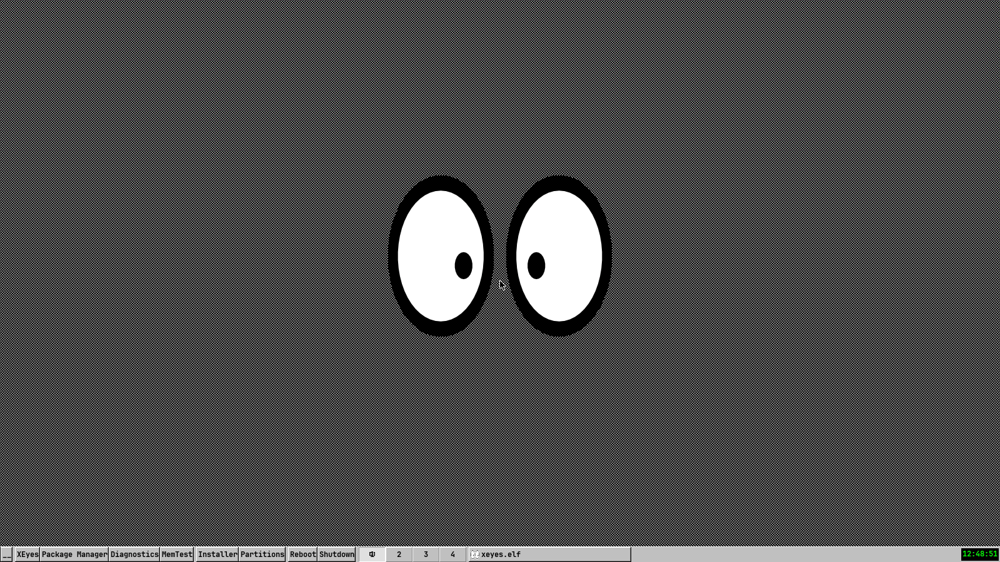
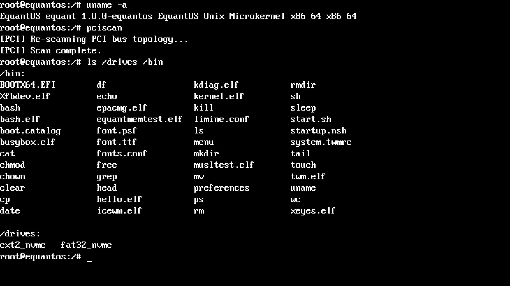
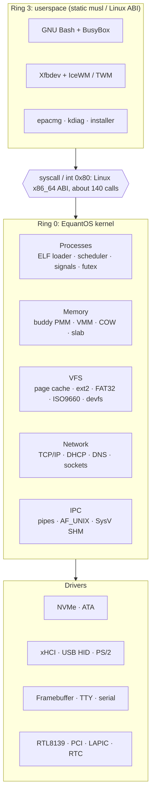
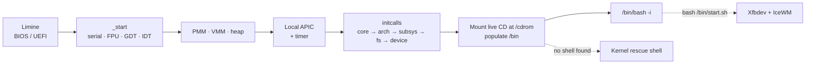

<div align="center">


<br/>


<br/><br/>

**[Screenshots](#-screenshots)** •
**[Features](#-features)** •
**[Architecture](#%EF%B8%8F-architecture)** •
**[Quick start](#-quick-start)** •
**[Using EquantOS](#-using-equantos)** •
**[Roadmap](#%EF%B8%8F-roadmap)** •
**[Known issues](#-known-issues)**

</div>

---

EquantOS is a hobby **monolithic kernel for x86_64**, written from scratch. It boots through
[Limine](https://github.com/limine-bootloader/limine) on BIOS and UEFI, brings up its own memory
manager, scheduler, VFS, storage, USB, and network stacks, and then runs **unmodified static Linux
binaries** in Ring 3: GNU Bash, BusyBox, the Xfbdev X server, and the IceWM window manager.

QEMU is the primary target. EquantOS has also booted on real x86_64 hardware.

> [!WARNING]
> Early alpha. Run it in a VM or on spare test hardware only.
> Do not keep anything you care about on disks it can write to.

---

## 📸 Screenshots

<table>
  <tr>
    <td width="50%"></td>
    <td width="50%"></td>
  </tr>
  <tr>
    <td align="center"><b>X11 desktop</b><br/><sub>Xfbdev + IceWM + xeyes at 1600×900×32</sub></td>
    <td align="center"><b>Console</b><br/><sub>GNU Bash 5.2 + BusyBox on the framebuffer TTY</sub></td>
  </tr>
</table>

<sub>Both captured in QEMU from a build of <code>main</code>.</sub>

---

## ⚡ At a glance

| | |
|---|---|
| **Architecture** | x86_64, single core, higher-half kernel |
| **Kernel type** | Monolithic, Linux-style staged initcalls |
| **Bootloader** | Limine v8, base revision 3, hybrid BIOS/UEFI ISO |
| **Userspace ABI** | Linux x86_64 syscalls (`syscall` and `int 0x80`), about 140 implemented |
| **C library** | musl 1.2.6, static, vendored in `sdk/` |
| **Shell** | GNU Bash 5.2 + BusyBox, with a built-in kernel rescue shell as fallback |
| **Graphics** | Framebuffer with write-combining, Xfbdev X server, IceWM / TWM |
| **Storage** | NVMe, ATA PIO · GPT, MBR · ext2, FAT32, ISO9660 |
| **Network** | RTL8139 · ARP, IPv4, ICMP, UDP, TCP, DHCP, DNS · HTTPS via BearSSL |
| **Version** | `0.0.1-alpha` |

---

## ✨ Features

<table>
<tr>
<td width="33%" valign="top">

### 🧠 Core
- Limine boot, HHDM, framebuffer
- GDT, IDT, exception handling and panic screen
- **Local APIC** with LAPIC timer at 250 Hz (calibrated against the PIT), legacy 8259 masked
- FPU/SSE enabled and saved per task

</td>
<td width="33%" valign="top">

### 🗂️ Memory
- Buddy physical allocator
- 4-level paging, **2 MiB huge pages**
- **PAT**: write-combining framebuffer, strict UC for MMIO
- Per-process address spaces, **copy-on-write**
- Slab kernel heap

</td>
<td width="33%" valign="top">

### ⚙️ Processes
- ELF64 loader, SysV initial stack
- Preemptive scheduler, Ring 3 tasks
- `fork`, `vfork`, `clone`, `execve`, `wait4`
- `futex`, basic signals, pipes
- AF_UNIX sockets, SysV shared memory

</td>
</tr>
<tr>
<td valign="top">

### 💾 Storage and filesystems
- VFS with mount points, RAMFS root
- **Unified page cache** with LRU/clock eviction (8 MiB pool)
- ext2 (read/write, indirect blocks), FAT32, ISO9660
- GPT and MBR discovery
- NVMe (DMA), legacy ATA PIO

</td>
<td valign="top">

### 🔌 Devices
- PCI enumeration
- xHCI + USB HID keyboard and mouse
- PS/2 keyboard
- devfs: `/dev/fb0`, `/dev/input/event*`, `/dev/input/mice`, `/dev/tty*`, `/dev/urandom`
- Shadow framebuffer flushed to VRAM
- RTC, COM1 serial log, reboot and power-off

</td>
<td valign="top">

### 🌐 Network
- RTL8139 driver
- ARP, IPv4, ICMP
- UDP, TCP with retransmission
- DHCP client, DNS resolver
- BSD sockets for userspace
- HTTPS from userspace via BearSSL

</td>
</tr>
<tr>
<td valign="top">

### 🖥️ Desktop
- Xfbdev X server on `/dev/fb0`
- IceWM with a custom launcher menu
- TWM as an alternative
- Fontconfig + TrueType font

</td>
<td valign="top">

### 📦 Userspace tools
- `epacmg`: package manager over HTTPS
- `kdiag`: kernel diagnostics from Bash
- Interactive installer to NVMe
- Users, `su`, `passwd`, `useradd`, login

</td>
<td valign="top">

### 🛟 Rescue shell
- About 60 built-in kernel commands
- Disk, memory, PCI, USB, CPU probes
- Stress tests and benchmarks
- Starts automatically if no userland shell is found

</td>
</tr>
</table>

---

## 🏗️ Architecture



### Boot sequence



---

## 🚀 Quick start

### 1. Install the toolchain

| Tool | Purpose |
|---|---|
| `x86_64-elf-gcc`, `x86_64-elf-ld` | Cross-compiler and linker for the kernel and userspace |
| `nasm` | Assembly sources |
| GNU Make | Build system |
| `xorriso` | ISO generation |
| Python 3 | Test disk images |
| `qemu-system-x86_64` | Running the system |

The Makefile works from a POSIX shell (Linux, macOS, MSYS2/Git Bash) and from plain Windows `cmd.exe`.

### 2. Clone

```bash
git clone https://github.com/Equinox-Collective/EquantOS.git
cd EquantOS
```

> [!IMPORTANT]
> **On Windows**, clone with `git clone -c core.autocrlf=false ...`. With `autocrlf=true`, Git checks
> out `res/.bashrc` with CRLF line endings, and Bash inside EquantOS fails to parse it at boot.

### 3. Provide the two things a fresh clone is missing

**Limine binaries.** The Makefile expects them in the repository root. `.limine.stamp` is committed,
so `make` does not download them by itself. Copy the vendored ones:

```bash
cp limine/* .
```

**musl startup objects.** `crt1.o`, `crti.o`, and `crtn.o` are excluded by the `*.o` rule in
`.gitignore`. Build them from the vendored musl source:

```bash
x86_64-elf-gcc -std=c99 -ffreestanding -fno-stack-protector -fno-pie -fno-pic -O2 -DCRT -Isdk/musl/arch/x86_64 -Isdk/musl/arch/generic -Isdk/musl/src/include -Isdk/musl/src/internal -Isdk/musl/include -Isdk/sysroot/include -c sdk/musl/crt/crt1.c -o sdk/sysroot/lib/crt1.o
```

```bash
x86_64-elf-gcc -c sdk/musl/crt/x86_64/crti.s -o sdk/sysroot/lib/crti.o
```

```bash
x86_64-elf-gcc -c sdk/musl/crt/x86_64/crtn.s -o sdk/sysroot/lib/crtn.o
```

### 4. Build and run

```bash
make run
```

This builds `build/equantos.iso`, creates the test disks if they are missing, and boots everything in
QEMU under UEFI. The kernel log goes to your terminal over the serial port.

---

## 🛠️ Build reference

| Command | What it does |
|---|---|
| `make` | Build `build/equantos.iso` |
| `make run` | Build, create disks if missing, boot the ISO in QEMU (UEFI via `OVMF.fd`) |
| `make runbd` | Boot the installed system from `disk_gpt_ext2.img` |
| `make debug` | Boot paused (`-S`) with a GDB server on `:1234` (`-s`) |
| `make disks` | Create the test disk images if they do not exist |
| `make clean` | Remove `build/`, `net.pcap`, and `.limine.stamp` |
| `make clean-disks` | Delete both disk images |
| `make clean-all` | `clean` + `clean-disks` + Limine download leftovers |
| `make V=1` | Verbose: print the full compiler and linker commands |

> [!CAUTION]
> `clean-disks` and `clean-all` delete the disk images and everything written to them,
> including an installed system.

<details>
<summary><b>Debugging with GDB</b></summary>

<br/>

```bash
make debug
```

Then, in a second terminal:

```bash
gdb build/kernel.elf -ex "target remote :1234"
```

</details>

<details>
<summary><b>QEMU machine and test disks</b></summary>

<br/>

`make run` emulates:

- 512 MiB RAM, `std` VGA, OVMF UEFI firmware
- xHCI controller with a USB keyboard and a USB mouse
- RTL8139 NIC on QEMU user networking (traffic is dumped to `net.pcap`)
- Serial console on stdio

| Image | Size | Layout | Attached as |
|---|---|---|---|
| `disk_gpt_ext2.img` | 128 MiB | GPT: ESP (FAT32, 40 MiB) + ext2 root (64 MiB) | NVMe |
| `disk_mbr_fat32.img` | 64 MiB | MBR + FAT32 | IDE |

At boot the kernel scans only the NVMe device and mounts its partitions at
`/drives/fat32_nvme` and `/drives/ext2_nvme`. The IDE image is kept for legacy ATA development.
`make runbd` boots the NVMe disk directly, which is how you test a system written by the installer.

</details>

---

## 🧭 Using EquantOS

On boot the kernel mounts the live CD at `/cdrom`, exposes its files under `/bin` and `/sys/bin`,
and starts `/bin/bash`. If no userland shell exists, it drops into the built-in rescue shell.

### Shell

`res/.bashrc` turns BusyBox applets and kernel diagnostics into regular commands:

```bash
uname -a          # EquantOS equant 1.0.0-equantos ... x86_64
ls /drives        # mounted NVMe partitions
pciscan           # alias for: kdiag pciscan
sysinfo           # alias for: kdiag sysinfo
installer         # interactive installer to the NVMe disk
```

### Desktop

```bash
bash /bin/start.sh
```

`start.sh` prepares fonts and IceWM configs, starts **Xfbdev** on `:0` at 1600×900×32, and launches
**IceWM**. The taskbar menu has XEyes, Package Manager, Diagnostics, MemTest, Installer, Partitions,
Reboot, and Shutdown.

### Package manager

```bash
epacmg sync         # or -Sy: fetch the package list
epacmg list         # or -Q:  show available packages
epacmg ins <pkg>    # or -S:  download and install a package
```

Packages are `.epkg` tarballs fetched over HTTPS. The default list lives in
[`ewasion137/epacmg-trans`](https://github.com/ewasion137/epacmg-trans).

<details>
<summary><b>Kernel rescue shell commands</b></summary>

<br/>

| Area | Commands |
|---|---|
| General | `help` `clear` `echo` `uptime` `eqfetch` `ver` `sleep` `reboot` `shutdown` |
| Files | `ls` `cat` `cd` `pwd` `cp` `mkdir` `touch` `writefile` `hexdump` `run` `mountinfo` |
| Memory | `mem` `memstress` `heapdump` `sysinfo` `vmstress` `pmmbench` |
| Storage | `diskinfo` `ataread` `nvmeread` `atastress` `nvmestress` `ioperf` `fstest` `mkfstest` |
| Filesystems | `gptdump` `mbrdump` `fatinfo` `ext2info` |
| Hardware | `pciscan` `pcipeek` `cpuinfo` `msrtest` `inbtest` `xhcitest` `devtest` |
| Processes | `ps` `schedtest` `panic_test` |
| Display | `colortest` `fonttest` `ttytest` |
| Users | `whoami` `su` `passwd` `useradd` `login` |
| Network | `ping` `dns` `wget` |
| System | `installer` |

</details>

<details>
<summary><b>Implemented syscalls</b></summary>

<br/>

| Group | Syscalls |
|---|---|
| Files | `read` `write` `open` `openat` `close` `stat` `fstat` `lstat` `newfstatat` `lseek` `pread64` `pwrite64` `readv` `writev` `access` `faccessat` `getdents64` `fcntl` `ioctl` `truncate` `ftruncate` `rename` `renameat` `mkdir` `mkdirat` `rmdir` `unlink` `unlinkat` `link` `linkat` `readlink` `readlinkat` `chmod` `fchmod` `fchmodat` `chown` `fchown` `umask` `getcwd` `chdir` `dup` `dup2` `dup3` `pipe` `pipe2` |
| Memory | `mmap` `mprotect` `munmap` `mremap` `brk` `msync` `mincore` `madvise` `shmget` `shmat` `shmdt` `shmctl` |
| Processes | `fork` `vfork` `clone` `execve` `exit` `exit_group` `wait4` `getpid` `getppid` `gettid` `getpgid` `getpgrp` `setpgid` `setsid` `set_tid_address` `set_robust_list` `rseq` `arch_prctl` `futex` `sched_yield` `prlimit64` `getrlimit` `getrusage` `times` |
| Signals | `rt_sigaction` `rt_sigprocmask` `rt_sigreturn` `sigaltstack` `kill` `tkill` `tgkill` |
| Time | `nanosleep` `clock_gettime` `gettimeofday` `getitimer` `setitimer` |
| Polling | `poll` `ppoll` `select` `pselect6` |
| Sockets | `socket` `socketpair` `bind` `listen` `accept` `accept4` `connect` `sendto` `recvfrom` `sendmsg` `recvmsg` `setsockopt` `getsockopt` `getpeername` `getsockname` `shutdown` |
| Identity | `uname` `sysinfo` `getuid` `geteuid` `getgid` `getegid` `setuid` `setgid` |
| EquantOS | `400` kernel diagnostics bridge (`kdiag`) · `401` DNS resolve (`epacmg`) |

</details>

---

## 📁 Repository layout

```
EquantOS/
├── src/
│   ├── main.c                 kernel entry point (_start)
│   ├── linker.ld              higher-half linker script
│   ├── equterm/               framebuffer terminal + rescue shell
│   ├── kernel/core/           GDT/IDT, LAPIC, PIC, PMM, VMM, heap, initcalls, panic
│   ├── kernel/proc/           ELF loader, tasks, scheduler, syscalls, pipes, init
│   ├── kernel/fs/             VFS, page cache, RAMFS, devfs, ext2, FAT32, ISO9660, GPT/MBR
│   ├── kernel/drivers/        PCI, NVMe, ATA, xHCI/USB HID, PS/2, TTY, serial, RTL8139
│   ├── kernel/net/            ARP, IPv4, ICMP, UDP, TCP, DHCP, DNS, sockets
│   ├── kernel/ipc/            AF_UNIX sockets, SysV shared memory
│   ├── kernel/misc/           installer, users, RTC, timer, power, RNG
│   └── libs/                  freestanding string/stdio for the kernel
├── userspace/                 epacmg, kdiag, hello, musltest, equantmemtest
├── sdk/
│   ├── musl/                  vendored musl 1.2.6 source
│   └── sysroot/               headers + static libs (libc, libm, BearSSL, ...)
├── res/                       prebuilt Bash, BusyBox, X11 binaries, configs, fonts, IceWM theme
├── limine/                    vendored Limine binaries
├── DOCS/                      TODO list and screenshots
├── create_disks.py            QEMU test disk generator
└── OVMF.fd                    UEFI firmware for QEMU
```

---

## 🗺️ Roadmap

From [`DOCS/TODO.md`](DOCS/TODO.md). The project is in long-term development and moves at a hobby pace.

**Done:** boot and serial log · panic handler · PS/2 keyboard and terminal · heap, PMM, VMM ·
scheduler and syscalls · RAMFS and VFS · ATA and MBR · power · FAT32 · ext2 · NVMe and GPT ·
real hardware boot · musl and Linux ABI · BusyBox and Bash · USB · installer ·
package manager · networking with HTTPS

**Next:**

- [ ] GPU acceleration through LinuxKPI
- [ ] Sound: PC Speaker first, then Intel sound cards
- [ ] Richer GUI: GTK or Qt apps, Wayland, or a native toolkit
- [ ] Proper root/user permission model
- [ ] Installer on real hardware

---

## 🐛 Known issues

- A fresh clone needs the Limine copy and the `crt*.o` build from [Quick start](#3-provide-the-two-things-a-fresh-clone-is-missing).
- The IceWM MinimalDark theme ships in `res/` but does not load yet, so IceWM falls back to its default look.
- `/proc` is not implemented, so BusyBox tools that read it (for example `free`) fail.
- `ls /dev` reports that the directory does not exist, although opening device nodes works.
- Some pipelines can hang the shell (for example `ls /bin | wc -l`).
- The IDE/FAT32 image is not scanned at boot, and its 64 MiB geometry is rejected by the FAT32 driver.
- ext2 has no delete, rename, or clean unmount yet.
- Single CPU only, no SMP.
- The ELF loader, scheduler, FD model, and syscall layer are development code. User accounts are not a security boundary.

---

## 🤝 Contributing

Issues and pull requests are welcome. Keep changes focused, make sure `make` still produces a bootable
ISO, and describe how you tested in QEMU.

---

## 📜 License

EquantOS is licensed under the **GNU General Public License v2.0**. See [`LICENSE.md`](LICENSE.md).

Third-party components keep their own licenses: musl (`sdk/musl/COPYRIGHT`), Limine, BearSSL,
GNU Bash, BusyBox, the X.Org components, IceWM, and the fonts in `res/`.

<div align="center">


</div>
